# Lab-How-To-Create-a-CloudWatch-Alarm-for-CPU-Utilization

## 1. Create EC2 for Amazon Linux

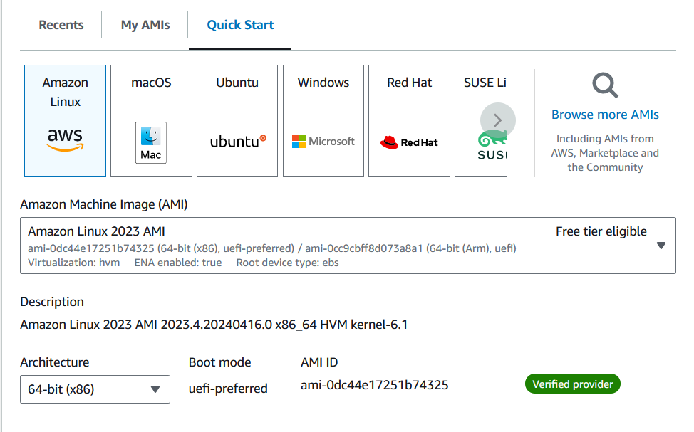

## 2. Create Cloudwatch Alarm

- In the AWS Management Console, type `cloudwatch` into the search box, and then select the `CloudWatch` service.

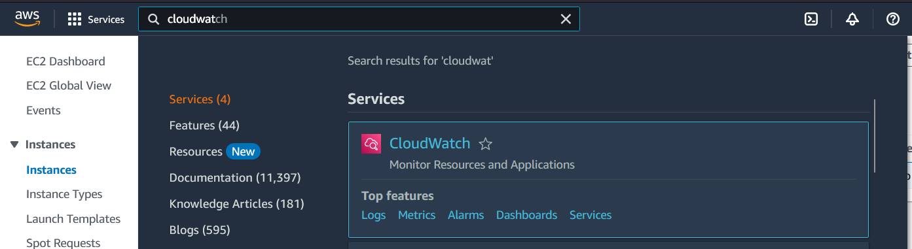

- Click `All alarms`

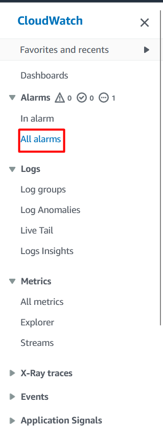

- Click `Create alarm`

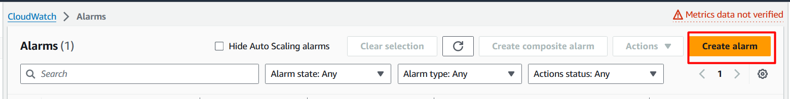

- Click `Select metric` 

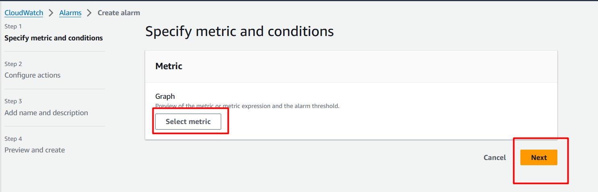

- Click `EC2`

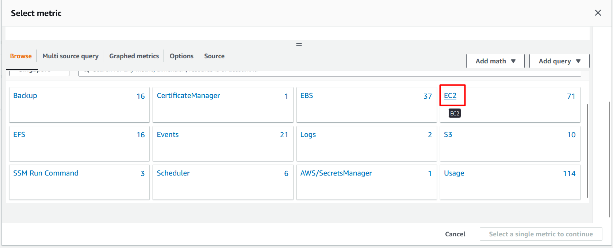

- Click `Per-Instance Metrics`

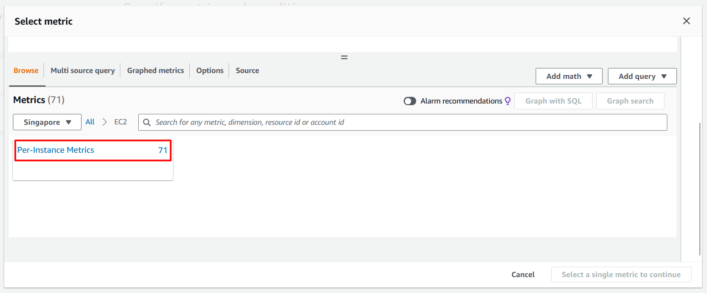

- Select `Cloudwatch Lab` and click `Create alarm`

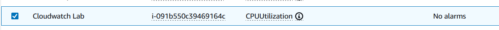

- Set Period based on your need

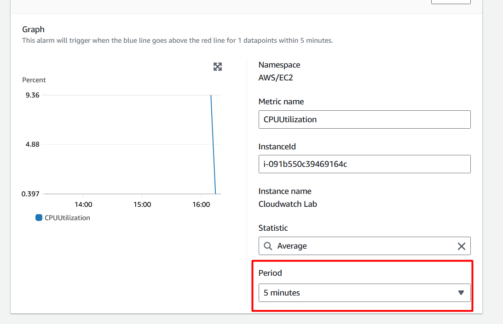

- Select `Greater/Equal` and Write `80` and then Click `Next`

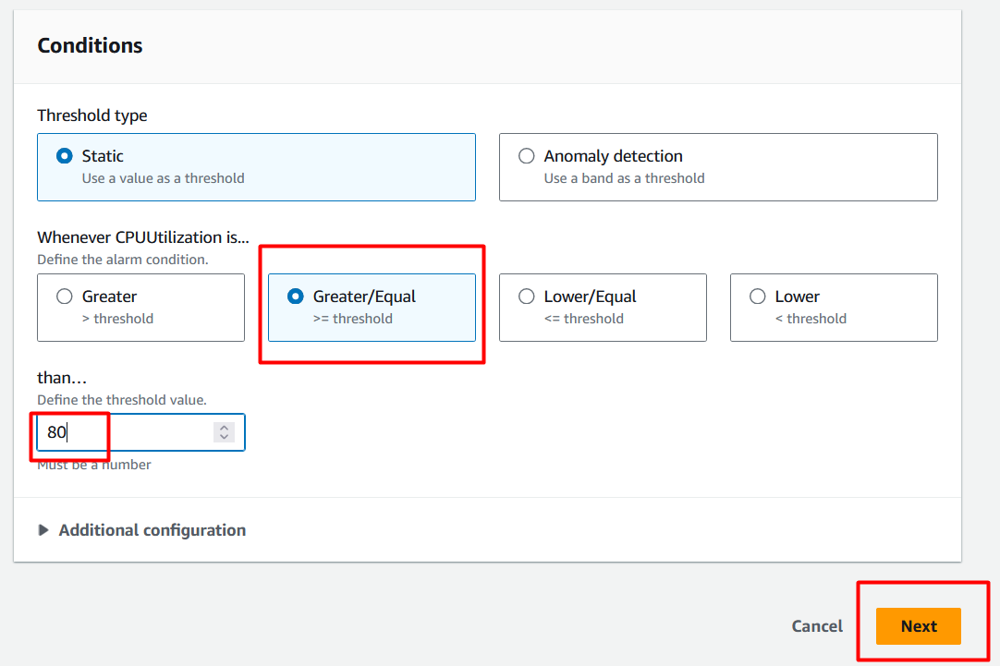

- Select `Create new topic` , Write topic name and your email then click `Next`

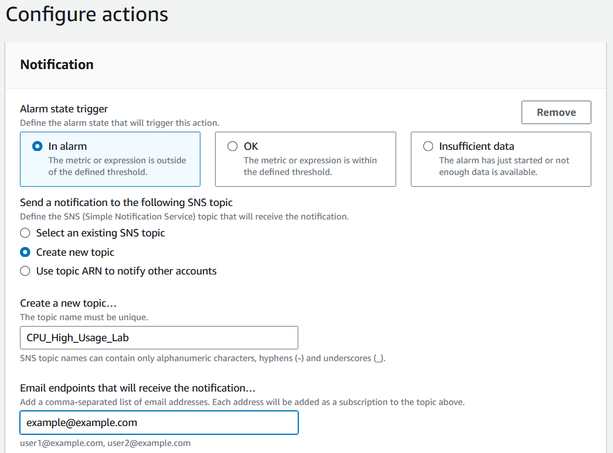

- Write `CPU High Usage Alert` and click `Next` then click `Create alarm`

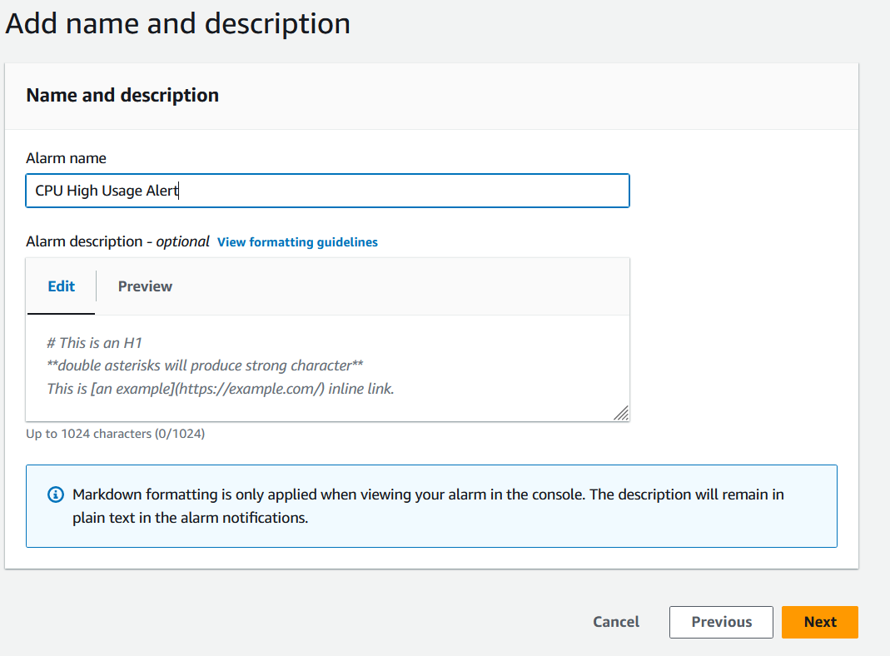

## Install stress application at EC2

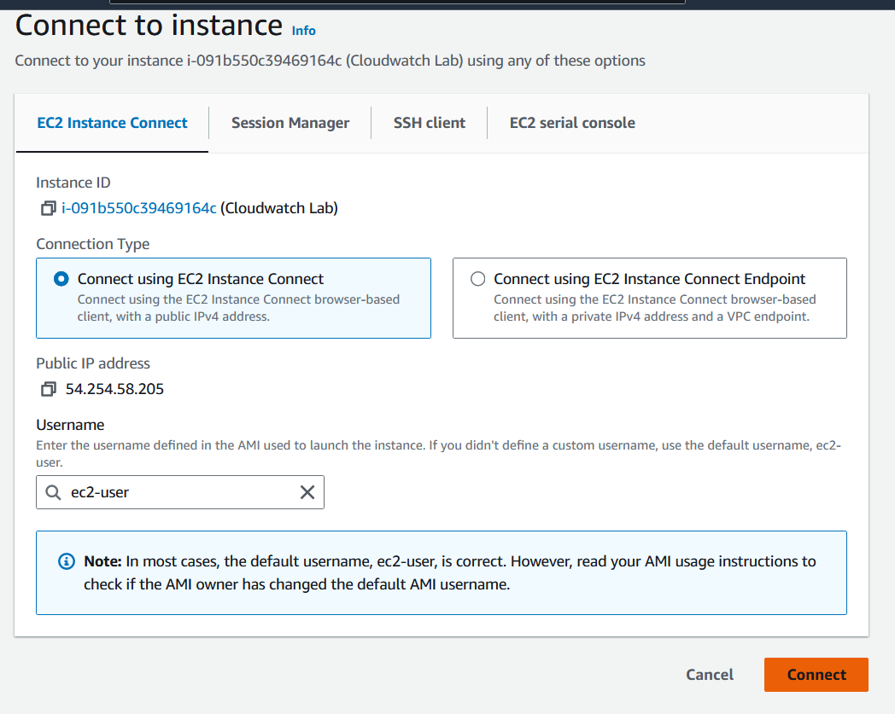